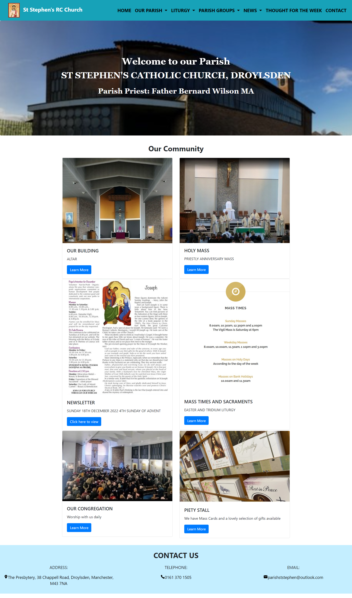

# st-stephen-website-refractor

## Description
This is a refactor of the home page of the st stephen's catholic church website (http://www.st-stephens-droylsden.com/) to ensure it gives a better user experience.

## Screenshot
The following image shows the web application's appearance and functionality:

## Link
Below is a link to the St stephen's webpage:

* [st stephens webpage]( https://aobiaderi.github.io/st-stephen-website-refractor/)